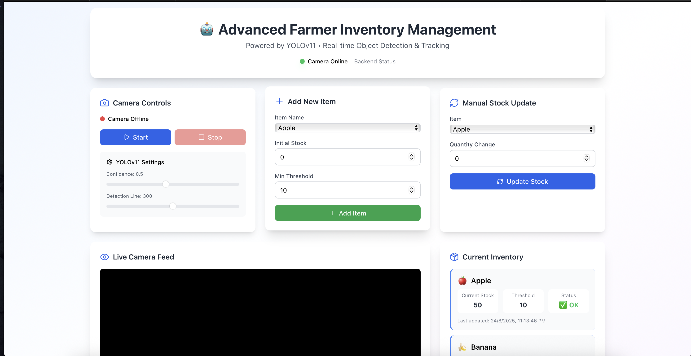
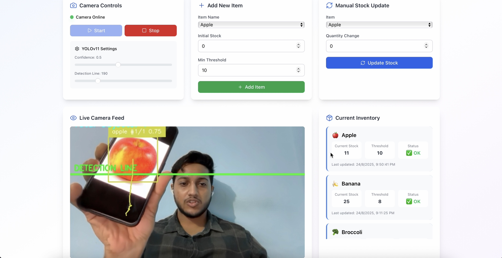
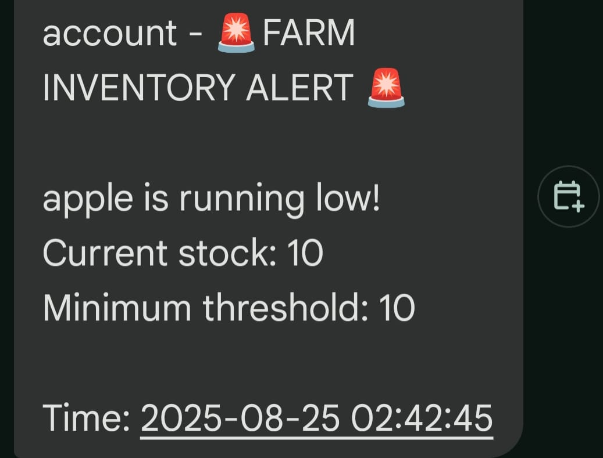
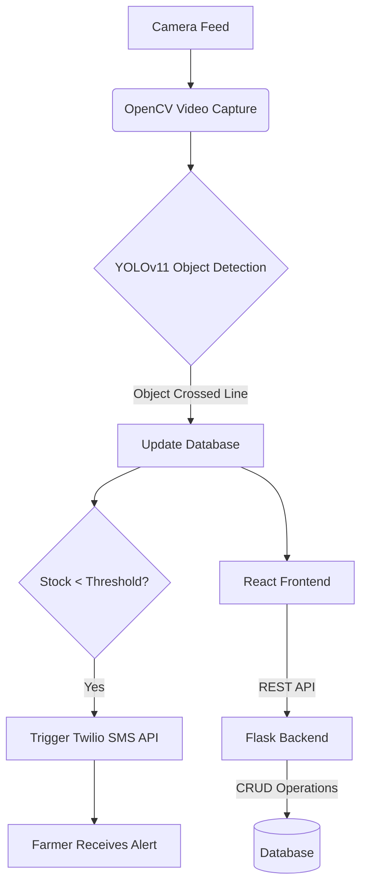

<div>
<h2 align="center">🧑‍🌾 Smart Inventory Management System</h2>

<p align="center">
  <a href="https://www.python.org/"></a>
  <a href="https://www.mongodb.com/"></a>
  <a href="https://opencv.org/"></a>
  <a href="https://pytorch.org/"></a>
  <a href="https://reactjs.org/"></a>
  <a href="https://streamlit.io/"></a>
  <a href="https://opensource.org/licenses/MIT"></a>
</p>
<br>
<div align="center">
    <div>
      <a href="https://drive.google.com/file/d/17tcCczXaBVLZVIWOP7DyQyGZpOlBfoZD/view?usp=sharing" target="_blank">
        
      </a>
    </div>
  </div>
</div>

---

## 📌 Overview  

The **Smart Inventory Management System** is an **AI-powered solution** designed for **farmers and warehouses** to track, analyze, and manage agricultural products in real-time.  

It leverages **YOLO (You Only Look Once) object detection**, **MongoDB for inventory storage**, and **Streamlit for visualization**. Real-time alerts are sent via **Twilio SMS/WhatsApp** when stock is low or products are near expiry.  

## 💡 Features include: 

-   **👁️ Automated Visual Tracking:** Real-time object detection and counting using a live camera feed and YOLOv11.
-   **📱 SMS Notifications:** Instant Twilio-powered alerts when stock levels hit minimum thresholds.
-   **📊 Interactive Dashboard:** Clean React.js UI to view current stock, item status (`OK`/`LOW`), and update history.
-   **⚙️ Flexible Management:** Easily add new items, set initial stock, and define custom thresholds.
-   **✏️ Manual Stock Control:** Allows for manual adjustments and overrides to ensure data accuracy.

---

## 📽️ Visual Preview  

<p align="center">
  
  
  
</p>

<div align="center">
  <strong>Dashboard Interface</strong> • <strong>Real-time Object Detection</strong> • <strong>SMS Alert System</strong>
</div>

---

## 🏗️ System Architecture



---

## 📑 Why YOLO?  

YOLO (You Only Look Once) is chosen because:  
- ✅ Real-time **object detection** suitable for farms/warehouses  
- ✅ High accuracy for **small + large object tracking**  
- ✅ Efficient for **edge devices (Raspberry Pi/ESP32-CAM)**  

**Reference Papers:**  
- [YOLOv5: Real-Time Object Detection](https://arxiv.org/abs/1506.02640)  
- [Applications of Deep Learning in Agriculture](https://www.sciencedirect.com/science/article/pii/S0168169919300372)  

---

## 📂 Dataset & Sources    
- Augmented using **Roboflow** for better YOLO training  
---

## 🛠️ Tech Stack  

- **Python 3.9+**  
- **YOLOv5/YOLOv8** (for detection)  
- **OpenCV** (image preprocessing & camera feed)  
- **MongoDB** (NoSQL database for inventory)  
- **Streamlit** (UI Dashboard)  
- **Twilio API** (alerts & notifications)  

---

## ⚙️ Installation & Setup  

### 1. Clone Repository  
```bash
git clone https://github.com/your-username/smart-inventory.git
cd smart-inventory
```  

### 2. Setup Virtual Environment & Install Dependencies  
```bash
python -m venv venv
source venv/bin/activate   # Mac/Linux  
venv\Scripts\activate    # Windows  

pip install -r requirements.txt
```  

### 3. Start Application  
```bash
streamlit run app.py
npm start
```  

---

## 📊 Results  

- ✅ **92% detection accuracy** on crop dataset  
- ✅ Real-time **inventory tracking** with MongoDB backend  
- ✅ Automatic **alerts & insights** improve efficiency  

---

## 🔮 Future Scope  

- 🚀 Integration with **AR** for farmer training & visualization  
- 🌍 Multilingual chatbot for crop/fertilizer recommendations  
- 📦 AI-powered **supply chain optimization**  
- 🤖 AI Agents for **autonomous decision-making**  

---

## 📜 License  

This project is licensed under the **MIT License** – see the LICENSE file for details.  

---
